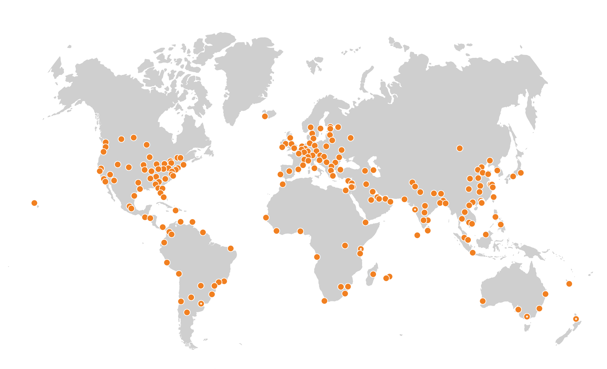

Cloudflare brand assets. Click any logo to open the full-resolution file; everything is directly downloadable.

## Logos & icons

  <figure><figcaption>cf-logo-v-rgb.png (4.3 KB)</figcaption></figure>
  <figure><figcaption>CF_logo_stacked_blktype.jpg (21.7 KB)</figcaption></figure>
  <figure><figcaption>cloudflare.png (22.4 KB)</figcaption></figure>
  <figure><figcaption>Cloudflare_400x400.jpg (7.5 KB)</figcaption></figure>
  <figure><figcaption>Cloudflare_Network_275__Cities_in_100__Countries.png (116.1 KB)</figcaption></figure>

[← Back to Branding Kits](../)
