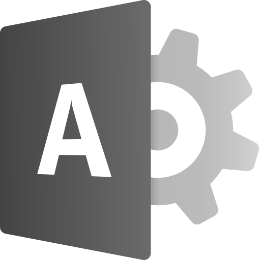
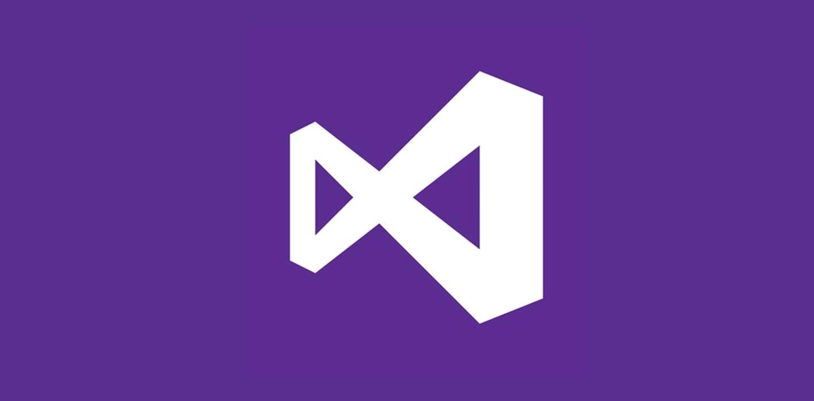
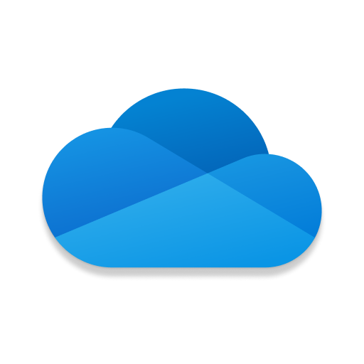

Microsoft brand assets. Click any logo to open the full-resolution file; everything is directly downloadable.

## Logos & icons

  <figure><figcaption>devbox.png (11.0 KB)</figcaption></figure>
  <figure><figcaption>icon-azure.png (1.6 KB)</figcaption></figure>
  <figure><figcaption>icon-ms-logo-v2.png (224 B)</figcaption></figure>
  <figure><figcaption>icon-teams.png (1.3 KB)</figcaption></figure>
  <figure><figcaption>icon-visual-studio.png (1.7 KB)</figcaption></figure>
  <figure><figcaption>icon-windows.png (170 B)</figcaption></figure>
  <figure><figcaption>icons8-microsoft-128.png (586 B)</figcaption></figure>
  <figure><figcaption>icons8-windows-11-128.png (930 B)</figcaption></figure>
  <figure><figcaption>m365_48x1.jpg (6.5 KB)</figcaption></figure>
  <figure><figcaption>m365_48x1.svg (4.7 KB)</figcaption></figure>
  <figure><figcaption>microsoft-365-admin-center.png (19.8 KB)</figcaption></figure>
  <figure><figcaption>microsoft-365.png (76.5 KB)</figcaption></figure>
  <figure><figcaption>microsoft-azure.png (33.2 KB)</figcaption></figure>
  <figure><figcaption>microsoft-onedrive.png (23.2 KB)</figcaption></figure>
  <figure><figcaption>microsoft-outlook.svg (4.3 KB)</figcaption></figure>
  <figure><figcaption>microsoft.512x512.png (1.3 KB)</figcaption></figure>
  <figure><figcaption>Microsoft_365_(2022).png (77.5 KB)</figcaption></figure>
  <figure><figcaption>Microsoft_VisualStudioLogo_2022.jpeg (19.0 KB)</figcaption></figure>
  <figure><figcaption>onedrive.png (27.1 KB)</figcaption></figure>
  <figure><figcaption>outlook.png (8.8 KB)</figcaption></figure>
  <figure><figcaption>teams_48x1.png (5.4 KB)</figcaption></figure>
  <figure><figcaption>visual-studio-code (1).png (25.8 KB)</figcaption></figure>
  <figure><figcaption>visual-studio-code.png (25.8 KB)</figcaption></figure>
  <figure><figcaption>visual-studio.png (35.1 KB)</figcaption></figure>
  <figure><figcaption>Visual_Studio_Icon_2022.svg.png (35.9 KB)</figcaption></figure>
  <figure><figcaption>Windows 3.png (64.8 KB)</figcaption></figure>
  <figure><figcaption>Windows Vista Media Center Round.png (407.6 KB)</figcaption></figure>
  <figure><figcaption>windows-11.png (74.7 KB)</figcaption></figure>
  <figure><figcaption>windows-hacker-icon.png (43.5 KB)</figcaption></figure>
  <figure><figcaption>windows-icon-png-5807.png (81.7 KB)</figcaption></figure>
  <figure><figcaption>windows-vista.png (160.2 KB)</figcaption></figure>

[← Back to Branding Kits](../)
