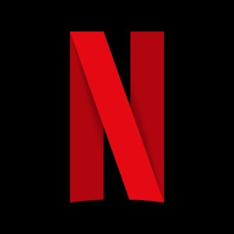
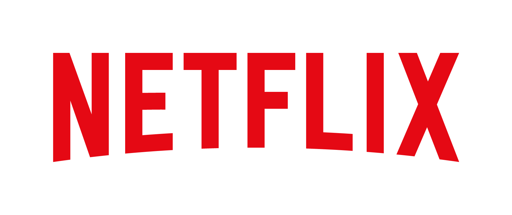
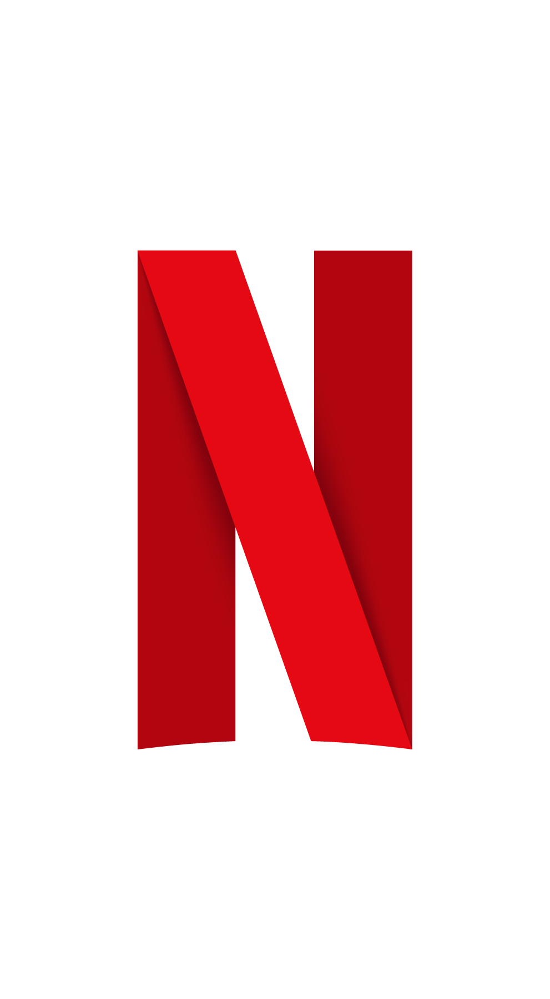

Netflix brand assets. Click any logo to open the full-resolution file; everything is directly downloadable.

## Logos & icons

  <figure><figcaption>Netflix_400x400.jpg (6.9 KB)</figcaption></figure>
  <figure><figcaption>Netflix_Logo_RGB.png (16.1 KB)</figcaption></figure>
  <figure><figcaption>Netflix_Symbol_RGB.png (55.9 KB)</figcaption></figure>

## Other files & sources

<ul>
  <li><a href="Netflix_Symbol_PMS_Guide.pdf">Netflix_Symbol_PMS_Guide.pdf</a> (133.6 KB)</li>
</ul>

[← Back to Branding Kits](../)
