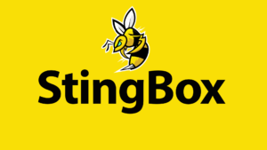

Official brand assets (logos, icons, wordmarks, and source files) for 17 companies and services.

  <a class="card" href="Apple/">Apple2 files</a>
  <a class="card" href="Automattic/">Automattic23 files</a>
  <a class="card" href="Backblaze/">Backblaze6 files</a>
  <a class="card" href="BuyMeACoffee/">BuyMeACoffee17 files</a>
  <a class="card" href="Cloudflare/">Cloudflare5 files</a>
  <a class="card" href="Discord/">Discord37 files</a>
  <a class="card" href="Dropbox/">Dropbox2 files</a>
  <a class="card" href="GitHub/">GitHub18 files</a>
  <a class="card" href="Google/">Google53 files</a>
  <a class="card" href="Mastodon/">Mastodon15 files</a>
  <a class="card" href="Medium/">Medium2 files</a>
  <a class="card" href="Microsoft/">Microsoft31 files</a>
  <a class="card" href="Netflix/">Netflix4 files</a>
  <a class="card" href="Proton/">Proton233 files</a>
  <a class="card" href="Squarespace/">Squarespace20 files</a>
  <a class="card" href="StingBox/">StingBox4 files</a>
  <a class="card" href="Stripe/">Stripe20 files</a>

[← Back to Resources](../)
